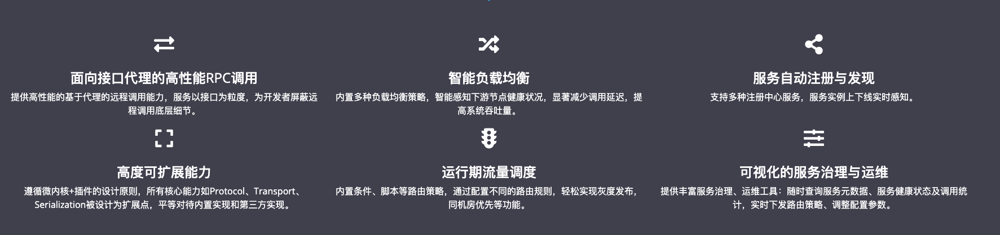
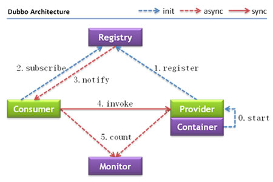
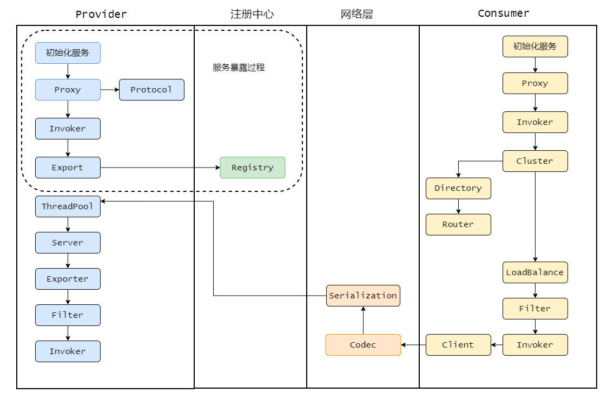
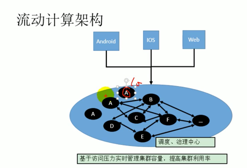
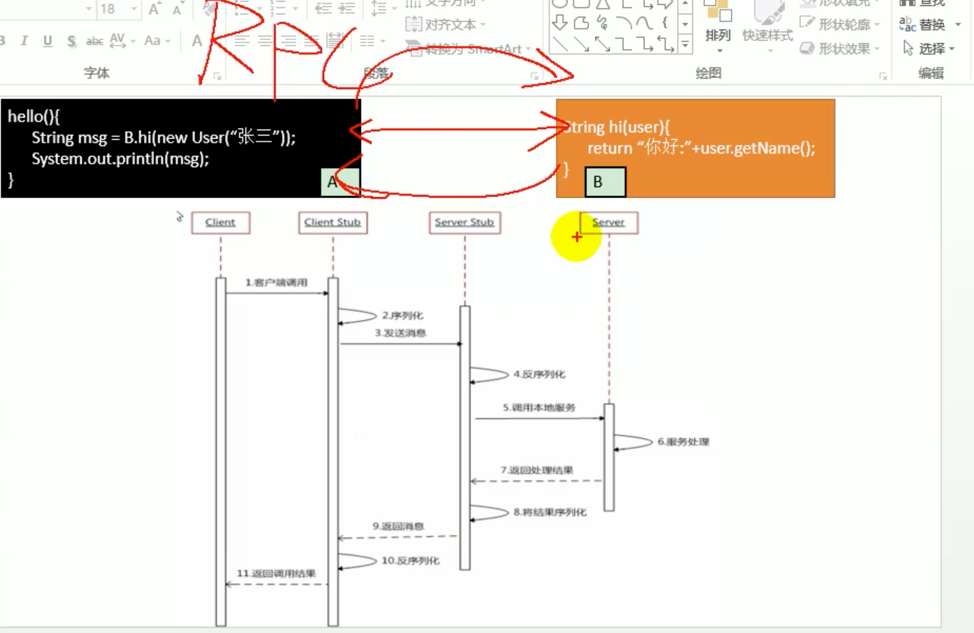
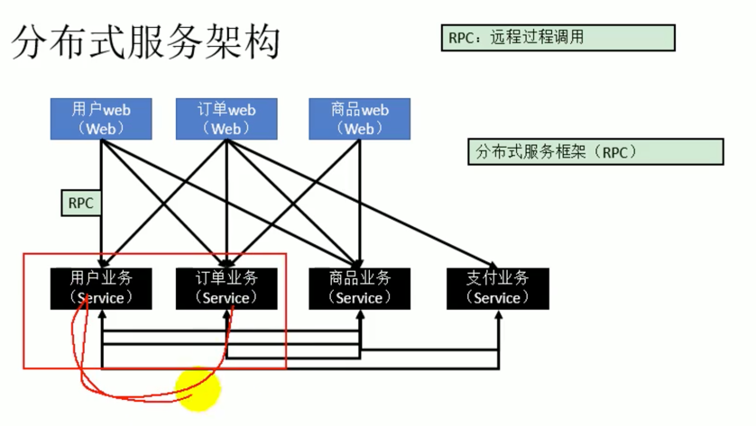
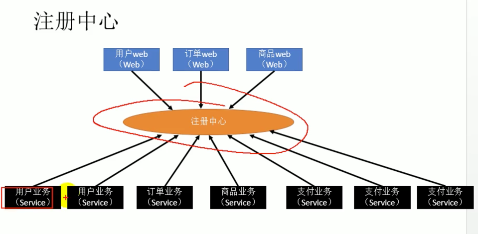

# Dubbo
####Dubbo的总体架构图
> 是一种RPC框架，RPC-Remote Procedure Call 即远程过程调用，远程过程调用其实对标的是本地过程调用。 

#### 作用
它实现了面向接口的代理 RPC 调用，并且可以配合 ZooKeeper 等组件实现服务注册和发现功能，并且拥有负载均衡、容错机制等。

#### Dubbo架构

>Provider	暴露服务的服务提供方
Consumer	调用远程服务的服务消费方
Registry	服务注册与发现的注册中心
Monitor	统计服务的调用次数和调用时间的监控中心
Container	服务运行容器

####每个节点作用

####消费过程

####服务调度、流量治理

####RPC框架的case解释

> Dubbo只是rpc框架的一种

#### 注册中心
> 类似于婚介中心，男、女各自需求进行匹配

