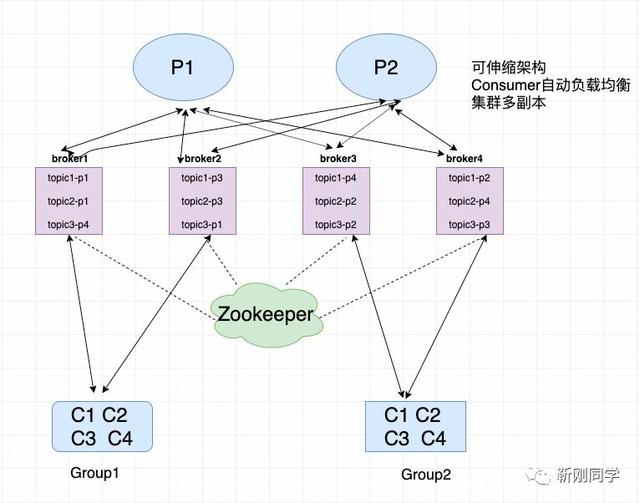
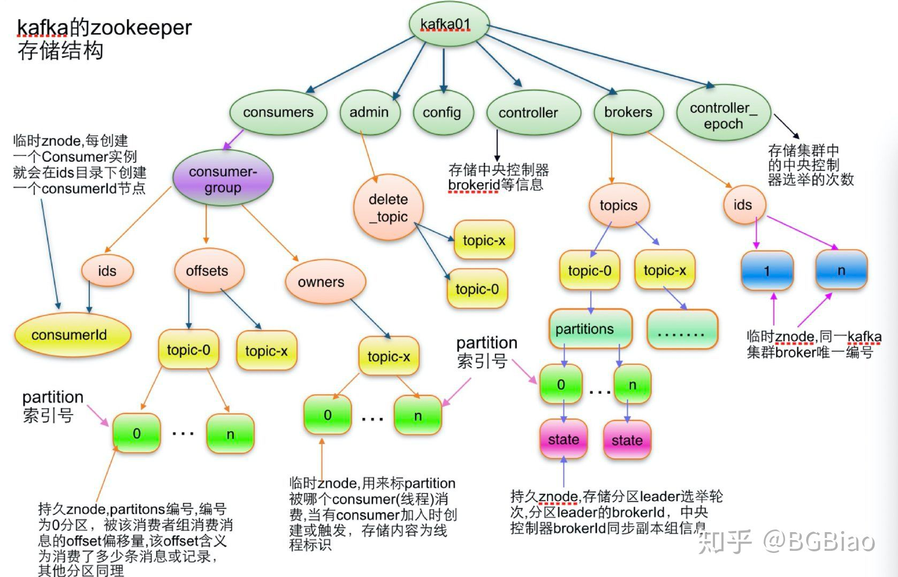
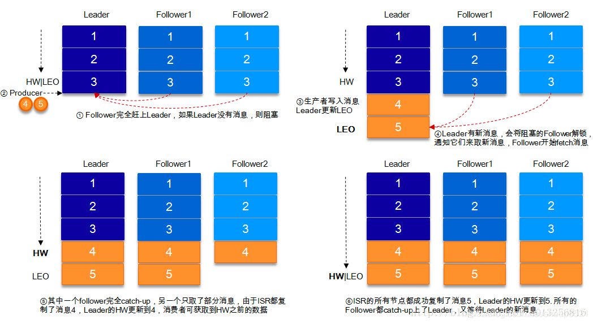
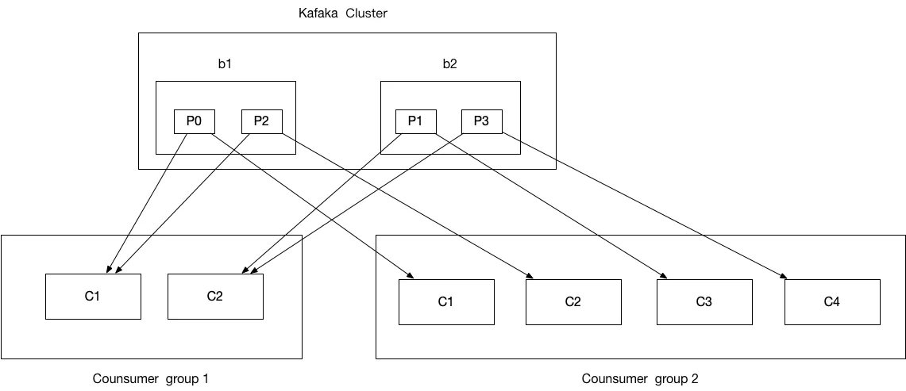
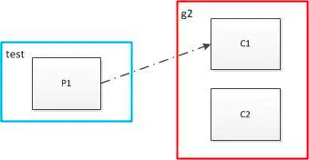
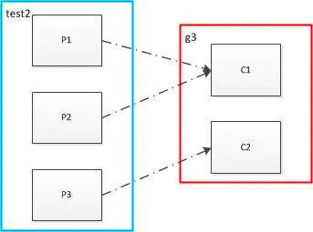
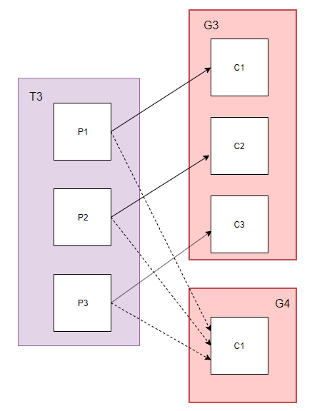
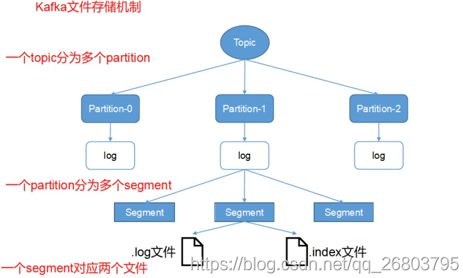
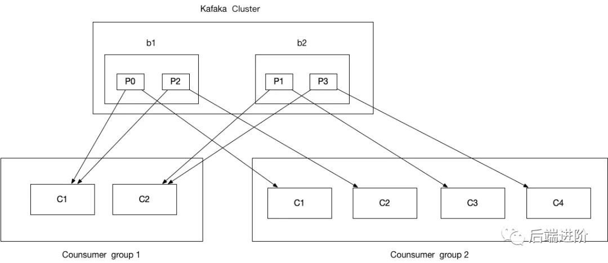

#### 吞吐量大、低延时

>kafka本身是基于磁盘读写的，得益于是顺序读写，如上图，每一个partition都是一个文件，
> 数据追加在partition的尾部，写消息只允许追加写入，不允许修改已经写入的数据。

一条消息存储于某一个具体的partition。同一个topic消息可存储于不通的partition(负载均衡)

#### kafka 元数据在 zk 中的分布

####zk上存储的Kafka数据结构

####topic副本同步机制

####重平衡跟消费组紧密相关，它保证了消费组成员分配分区可以做到公平分配，也是消费组模型的实现，消费组模型如下

#### topic的partition与consumer的group的关系
> 同一个partition内的消息只能被同一个组中的一个consumer消费。

> 多个消费组

####Kafka的日志目录结构

#####消费组消费

