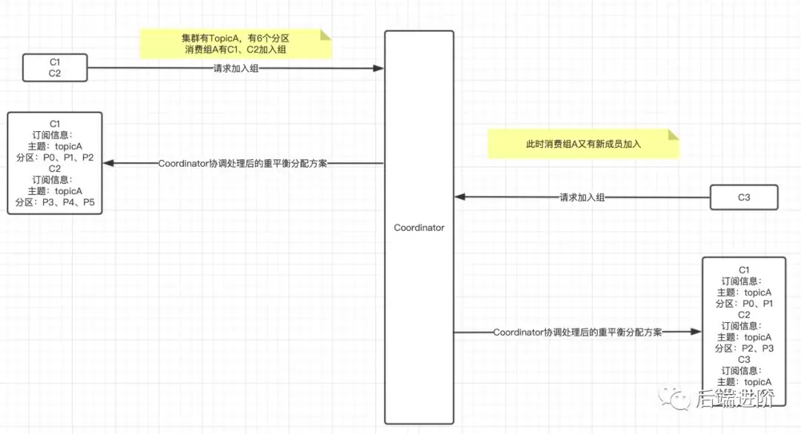
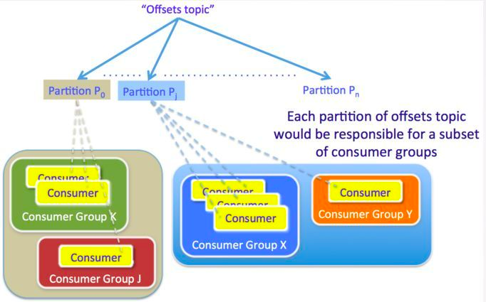

简单来说，kafka就是一个消息中间件
[toc]

#### 1、kafka与zk关系
Kafka 使用 ZooKeeper 来保存与分区和代理相关的元数据，并选举出一个代理作为集群控制器。目前kafka团队想要消除zk的依赖。 
Kafka需要使用Zookeeper来管理元数据，比如记录topic、partitions（分区）以及replica（副本）的分配信息。

    kafka设计开始，主要是解决四个问题：
    - 吞吐量/延时
    - 消息持久化
    - 负载均衡/鼓掌转移
    - 伸缩性
    
Kafka是将数据持久化到本地磁盘中，利用操作系统的缓存页，先将数据存储到缓存页中，缓存页到磁盘是操作系统决定的。

#### 2、zk上存储的kafka数据有哪些：元数据信息
服务端的broker信息，及提供的topic，每个topic的分区partition数据。
消费端：消费者的注册信息及偏移量数据 offset
新版的Kafka主要是server端对kafka的依赖，消费端已经移除对zk的依赖。
    Kafka把它的meta数据都存储在ZK上，所以说ZK是他的必要存在没有ZK没法运行Kafka；
    在老版本（0.8.1以前）里面消费段（consumer）也是依赖ZK的，
    在新版本中移除了客户端对ZK的依赖，但是broker依然依赖于ZK。
 ***新版本的消费者把这些信息保存在一个Kafka的内部主题中，由集群中一个名为Coordinator的组件进行管理。
日志文件：
 kafka日志文件夹的命名规则是：主题名-分区号，由.index文件、.log文件、.timeindex三个文件组成
 log文件中存在CreateTime。

#### 3、kafka清除topic数据
磁盘数据清理、zk数据清理、缓存数据清理。
删除磁盘上的数据时，根据创建的日志文件夹进行删除，主题名-分区号。
（https://blog.csdn.net/apei830/article/details/78773592）
    清理topic内的数据，zk中会创建一个delete_topic节点，该节点名为将删除数据的topic。
    在KafkaController的onControllerFailover方法中，初始化了partitionStateMachine状态机，
    并注册了相应的事件监听器，主要是监听zookeeper节点/admin/delete_topics下子节点的变化。当有childChange，即有新的topic需要被删除时，
    该handleChildChange会被触发，将该topic加入到deleteTopicManager的queue中。

#### 4、topic与partition关系，一条消息只可能属于一个partition
    一个topic可能有多个分区。producer产生消息后，经过分区器，最终坐落到某一个具体的partition，消费者也是从partition上消费消息。
    partition位于不同broker，但是其余broker上会有当前broker的副本，副本不会进行数据请求响应，只是作为backup使用，保证高可用性。

#### 5、broker上的副本数据如何进行数据同步：如图img_4
    leader会维护一个与其基本保持同步的Replica列表，该列表称为ISR.每个Partition都会有一个ISR.
    当ISR中所有Replica都向Leader发送ACK时，leader才commit，这时候producer才能认为一个请求中的消息都commit了。
  总结：消费者能消费的是HW之前的数据.

#### 6、rebalance机制，与消费组密切相关。
    https://www.cnblogs.com/chanshuyi/p/kafka_rebalance_quick_guide.html
 Rebalance顾名思义就是重新均衡消费者消费。简单就是：给消费组内的每个消费者分配任务的过程。
 可能发生的时机；1、分区个数的增加 2、对Topic的订阅发生变化 3、消费组成员的加入或离开（这个是我们最常遇到）。
 进行rebalance时，所有消费实例都不能进行消费。
 总结：
    每个consumer group会从kafka broker中选出一个作为组协调者（group coordinator）。coordinator负责对整个consumer group的状态进行管理，当有触发rebalance的条件发生时，促使生成新的分区分配方案。

#### 7、Kafka日志保存时间
    默认有7天，可以根据业务场景进行设置。（log.retention.hours=168小时-即7天）

#### 8、Kafka数据不断追加到磁盘上，数据不断累加，什么节点清理呢，清理的策略是什么？
   首先，Kafka默认数据只保留7天，会清理过期的数据。但是会有特殊情况，若某个消息的数据量就是特别大，占据的磁盘容量较高。
   需要修改默认值，配置清除策略：kafka的清除策略有删除、压缩。
   而且还可以根据文件大小size清理数据（log.retention.bytes），超过阈值进行清理。

#### 9、Kafka分区数、副本数和topic数量多少比较合适？
    首先确定一点，并不是分区数越多越好，一般分区数不要超过机器数量。分区数越多占用内存越大，一个节点集中的分区也就越多，
    当它宕机的时候，对系统的影响也就越大。
    分区数一般设置为：3-10 个。
    副本数一般设置为：2-3个。
    topic数量需要根据日志类型来定，一般有多少个日志类型就定多少个topic，不过也有对日志类型进行合并的。

#### 10、topic的分区数可以增加或减少吗？为什么？
    topic的分区数只能增加不能减少，因为减少掉的分区数即被删除的分区数据很难处理。

#### 11、kafka怎么维护offset？
 0.9版本之前是维护在zk中，新版本是kafka内部维护的topic，记录offset。
 数据消费成功就会修改offset，提交的是当前消费到的最新消息的offset+1而不是offset

 维护offset的原因：由于consumer在消费过程中可能会出现断电宕机等故障，consumer恢复后，需要从故障前的位置的继续消费，
 所以consumer需要实时记录自己消费到了哪个offset，以便故障恢复后继续消费。

#### 12、Kafka如何保证消息幂等？https://www.cnblogs.com/smartloli/p/11922639.html
 幂等：producer发送消息时，难免会出现重复消息发送。Producer进行retry时会产生重试机制，发生消息重复发送。引入幂等机制后
 重复发送只会有一条有效消息。
实现：
Kafka为了实现幂等性，它在底层设计架构中引入了ProducerID和SequenceNumber。那这两个概念的用途是什么呢？
    ProducerID：在每个新的Producer初始化时，会被分配一个唯一的ProducerID，这个ProducerID对客户端使用者是不可见的。
    SequenceNumber：对于每个ProducerID，Producer发送数据的每个Topic和Partition都对应一个从0开始单调递增的SequenceNumber值。
    ⚠️：SequenceNumber是同一个topic的同一个partition递增，唯一。只能保证单分区的幂等性。
        同一个partition内的消息只能被同一个组中的一个consumer消费。同一个组只会消费一个partition的消息一次。
        但是一个组可以消费不同partition，因此若不通partition上有相同消息内容，此时消费会出现重复。
相同的PID和SequenceNumber发送给Broker，而之前Broker缓存过之前发送的相同的消息，那么在消息流中的消息就只有一条，不会出现重复发送的情况。

#### 13、为什么kafka中1个partition只能被同组的一个consumer消费?
   思考：可能是为了保证有序性。假设是有一个组内的多个消费者进行消费，则比不能保证数据有序消费。

#### 14、Kafka中的选举机制

#### 15、Kafka异步发送消息也会有阻塞
    producer发送的消息先放入，消息缓冲池，有一个单独的sender线程进行消息发送，当消息缓冲池用完后，则会出现阻塞，等到池中有空间后继续发送。

# Producer
#### 1、ack
> page75---作用：producer消息发送到Kafka，写入结果何时返回给producer？这便是ack就是用来控制这个问题！producer什么时候发送下一条消息！

ack取值为0，1，-1(all)
    0-忽略所有返回值，直接发送。（有消息丢失）
    1-默认，消息写入本地日志即可，即leader broker消息写入即可。（也会出现丢失，但是概率较低）
    -1-不仅消息写入本地日志，同时副本也同步成功后发送下一条数据。

#### 2、producer 拦截器interceptor
> 目的：发送消息钱及回调逻辑执行前对消息做一些定制化修改。
> 也可以指定多个interceptor按照顺讯作用于一条消息-拦截链。org.apache.kafka.clients.producer.ProducerInterceptor

# Consumer

#### 1、rebalance重平衡
[https://www.kancloud.cn/nicefo71/kafka/1473378][Rebalance]
>本质上是一种协议，规定一个 consumer group下的所有consumer如何达成一致来分配订阅topic的所有分区。
> 保证分区公平分配且只能被同一个消费组中的一个消费者订阅。（重新均衡消费者消费）

发生rebalance情况（消费者停止消费）
- 消费组成员发生变更，有新消费者加入或者离开，或者有消费者崩溃；
- 消费组订阅的主题数量发生变更；
- 消费组订阅的分区数发生变更。

⚠️：rebalance只针对subscribe这种不指定分区消费的情况，如果通过assign这种消费方式指定了分区，kafka不会进行rebalance。

Coordinator

#### offset
每个 消费者（Consumer）对每个 Topic 都有一个 Offset 用来表示读取到了第几条数据
> 因为 Consumer 能够同时消费多个分区的数据，所以位移的提交实际上是在分区粒度上进行的，
> 即Consumer 需要为分配给它的每个分区提交各自的位移数据。

#### ISR
副本集合，分区纬度的，每个分区都有自己的一个ISR集合。

ISR中的数据是动态变化的：
    当存在follower同步数据大步落后于leader时，
    则会将其从ISR中移除，以免拖垮整个进度，并且当不在ISR中的follower，
    与leader同步时，leader又会将其加入到ISR中。

新版本的Kafka的ISR机制：
    用 replica.lag.time.max.ms 参数来代替，该参数的意思指的是允许 follower 副本不同步消息的最大时间值，
    即只要在 replica.lag.time.max.ms(默认值10s) 时间内 follower 有同步消息，即认为该 follower 处于 ISR 中，
    这就很好地避免了在某个瞬间生产者一下子发送大量消息到 leader 副本导致该分区 ISR 频繁收缩与扩张的问题了。

# Other
#### 2-1、Kafka事物
https://zhmin.github.io/2019/05/20/kafka-transaction/
目的：主要解决的是消息之间的一致性问题。确保在一个事务中发送的多条消息，要么都成功，要么都失败。
从0.11版本开始支持事物。

# Interviews
###  Kafka 为什么这么快
> 顺序写磁盘、大量使用内存页、零拷贝

从数据写入和读取两方面分析，为大家分析下为什么 Kafka 速度这么快
1、写---为了优化写入速度：使用磁盘顺序写入+内存映射文件MMFile（Memory Mapped File）
（磁盘顺序读写速度超过内存随机读写）
 MMFile直接利用操作系统的Page来实现文件到物理内存的映射，完成之后对物理内存的操作会直接同步到硬盘。
2、读---数据读取 Kafka 在读取磁盘时做的优化：零拷贝(基于Sendfile实现) + 批量处理 + 磁盘预读
 磁盘预读：将相邻的page数据进行预读放入page cache中，方便下次使用

### Kafka怎么保证消息不丢失的
>消息从producer产生，到broker保存，再到consumer消费，有很多流程及场景，可能出现丢失的情况。

生产者使用ack机制，broker使用副本机制，消费者使用offset机制(关闭自动提交，进行手动提交)。

producer：
    使用producer.send(msg)的API是异步发送消息，此时并不能保证消息发送成功，可能由于网络抖动等情况导致消息发送失败，造成消息丢失。
    使用producer.send(msg, callback)则可避免上面的情况

consumer
    比producer稍微复杂，有个offset的概念。
    kafka通过先消费消息，后更新offset，来保证消息不丢失。
    -若开启自动提交，当使用多线程消费消息时，如果有一个线程出现问题，但是还是提交了位移，会发生消息丢失。
这个问题的解决起来也简单：如果是多线程异步处理消费消息，consumer不要开启自动提交offset，consumer端程序自己来处理offset的提交更新。

### kafka支持事务么，你们项目中有使用么，它的原理是什么
[https://zhmin.github.io/2019/05/20/kafka-transaction/][事物]

### Kafka数据消费一致性
一致性是至：不管是当前的leader还是新选取的leader， consumer读取到的数据都是一样的。
解决：当老的leader挂了之后，从最小的offset进行消费。

面试题：https://www.taodudu.cc/news/show-627827.html

[rebal]: https://www.kancloud.cn/nicefo71/kafka/1473378

[事物]: https://zhmin.github.io/2019/05/20/kafka-transaction/