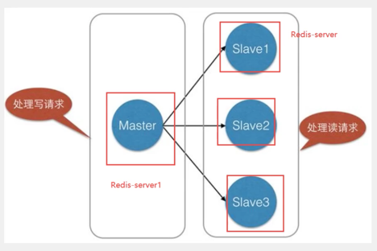
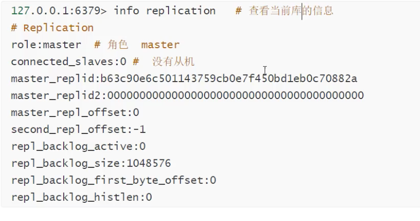
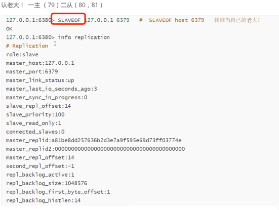
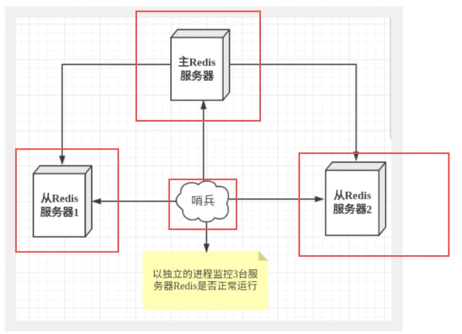
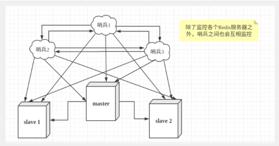
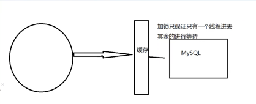

默认情况下，每台redis都是主节点。需要进行配置，哪个为主，哪个为从。
### Redis 发布订阅
 是一种消息通信模式，发送者、订阅者。微博等关注系统。
 
### Redis主从复制
将一台redis服务器数据复制到其余redis服务器。

> 目的：主从复制，读写分离，80%场景进行读操作，减轻服务器的压力！架构中经常使用。（最低配  一主二从）
> 作用：数据冗余，故障恢复，负载均衡，高可用（集群）的基础。

环境配置

### 一主二从
主从节点都是单独的redis服务器，主服务器、从服务器

默认情况下，每台redis都是主节点。需要进行配置，哪个为主，哪个为从。
一般情况下，只配置从机即可。给他分配老大。

注意无哨兵模式时的问题⚠️：
主机down掉，从机依旧连接到主机，但是没有写操作。若主机恢复，从机依旧可以直接获取主机写的信息。
若使用命令行，来配置主从，这个时候从机重启后，就会变成主机。只有配置为主机的从机，则会立即从主机中获取数据。
> 复制原理
> salve启动成功链接到master后会发送sync同步命令。
> master接到命令后，启动后台的存盘进程，同时手机所有接收到的用于修改数据集命令，在后台进程中执行完毕后，master将传送
> 整个数据文件到slave，并完成一次
> 完全同步。

全量复制：slave服务接收到数据库文件数据后，将其存盘并加载待内存中。
增量复制：master继续将新收集到的修改命令依次传给slave，完成同步。
只要重新链接master，一次完全同步（全量复制）将被自动执行！

### 哨兵模式sentinel（自动选举老大的模式）
> 谋朝篡位自动版，能够监控主机是否故障，如果故障了根据投票数(哨兵进行投票)自动将从机salve转化为主机master。

单哨兵模式 
单哨兵高可用较低，多哨兵模式
  failover故障转移

哨兵集群
优点：
 1、哨兵集群，基于主从复制，所有主从配置优点，他全有
 2、主从切换，故障可以转移，系统可用性更好
 3、哨兵模式是主从模式的升级，手动到自动，更加健壮
缺点：
 1、redis不好在线扩容，集群一旦达到上限，在线扩容比较麻烦
 2、实现哨兵模式的配置比较麻烦，里面选择较多

### Redis 的Sentinel VS Cluster 模式
> Sentinel哨兵模式是为了高可用，主服务器挂了哨兵可自动切换
> Cluster集群是因为单实例能力有限，高多个分散压力。为了解决单机Redis容量有限的问题，将数据按一定的规则分配到多台机器。

哨兵模式与主从模式所有节点的数据都是一样的，而集群模式节点数据不同（每台 Redis 节点上存储不同的内容）。
哨兵模式中只有主节点负责写数据，如果有大量的写数据请求时，主节点负载太高，有down机风险。为了解决此问题，cluster模式诞生。

### 集群数据分片
> Redis 集群有16384 个哈希槽，每个 key 通过 CRC16 校验后对 16384 取模来决定放置哪个槽。

### 集群脑裂（多个master）

### 缓存穿透、雪崩
服务的高可用问题

缓存穿透-查不到 ，
> 解决方案：布隆过滤器

缓存击穿-量太大，缓存过期
>热点数据不过期
> 加互斥锁

缓存雪崩-某一时间段，缓存集体失效，case：redis宕机

### 分布式锁

