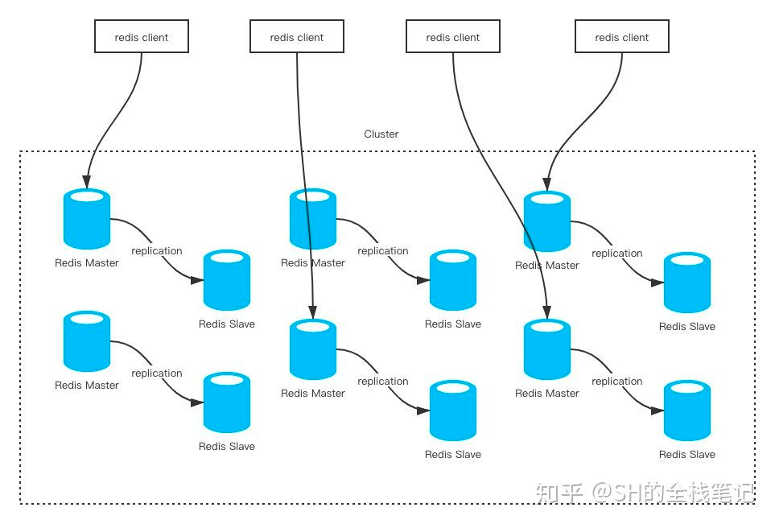
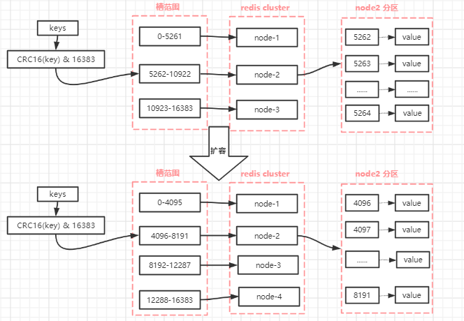

### Redis 的Cluster  - 集群
[https://zhuanlan.zhihu.com/p/337878020][redis 集群]
>很简单，你就可以理解为n个主从架构组合在一起对外服务。
> Redis Cluster要求至少需要3个master才能组成一个集群， 同时每个master至少需要有一个slave节点。
 

注意⚠️：
> 在Redis Cluster中的读、写请求其实都是在master上完成。slave只负责数据备份的能力，当master发生down机时，slave升级为master。

#### 节点负载均衡
>集群中有这么多master，当进行数据存取的时候，应该使用哪个节点呢？

一致性hash。（为什么不实用hash算法，考虑-哈希算法是对master实例数量来取模）
> 一致性哈希是对2^32取模，也就是值的范围在[0, 2^32 -1]。
> 一致性哈希将其范围抽象成了一个圆环，使用CRC16算法计算出来的哈希值会落到圆环上的某个地方。

Redis Cluster采用的是类一致性哈希算法
>一致性哈希是对2^32取模，而Redis Cluster则是对2^14（也就是16384）取模。
`key到hash槽映射算法：对每个key计算CRC16值，然后对16384取模
计算公式：slot = CRC16(key) & 16383`
槽是 Redis 集群管理数据的基本单位，集群伸缩就是槽和数据在节点之间的移动。

#### 集群如何进行扩容
通过reshard（重新分片）来实现

`1.首先启动一个 Redis 节点，记为 M4。
2.使用 cluster meet 命令，让新 Redis 节点加入到集群中。新节点刚开始都是主节点状态，由于没有负责的槽，所以不能接受任何读写操作，后续我们就给他迁移槽和填充数据。
3.对M4节点发送 cluster setslot { slot } importing { sourceNodeId } 命令，让目标节点准备导入槽的数据。 对源节点，也就是 M1，M2，M3 节点发送 cluster setslot { slot } migrating { targetNodeId } 命令，让源节点准备迁出槽的数据。
4.源节点执行 cluster getkeysinslot { slot } { count } 命令，获取 count 个属于槽 { slot } 的键，然后执行步骤五的操作进行迁移键值数据。
5.在源节点上执行 migrate { targetNodeIp} " " 0 { timeout } keys { key... } 命令，把获取的键通过 pipeline 机制批量迁移到目标节点，批量迁移版本的 migrate 命令在 Redis 3.0.6 以上版本提供。
6.重复执行步骤 5 和步骤 6 直到槽下所有的键值数据迁移到目标节点。
7.向集群内所有主节点发送 cluster setslot { slot } node { targetNodeId } 命令，通知槽分配给目标节点。为了保证槽节点映射变更及时传播，需要遍历发送给所有主节点更新被迁移的槽执行新节点
`
#### 集群收缩
`收缩节点就是将 Redis 节点下线，整个流程需要如下操作流程：
首先需要确认下线节点是否有负责的槽，如果有，需要把槽和对应的数据迁移到其它节点，保证节点下线后整个集群槽节点映射的完整性。
当下线节点不再负责槽或者本身是从节点时，就可以通知集群内其他节点忘记下线节点，当所有的节点忘记改节点后可以正常关闭。
下线节点需要将节点自己负责的槽迁移到其他节点，原理与之前节点扩容的迁移槽过程一致。迁移完槽后，还需要通知集群内所有节点忘记下线的节点，也就是说让其它节点不再与要下线的节点进行 Gossip 消息交换。
`

#### Redis Cluster主从选举
    1.slave发现自己的master变为FAIL。
    2.发起选举前，slave先给自己的epoch（即currentEpoch）加一，然后请求集群中其它master给自己投票，并广播信息给集群中其他节点。
    3.slave发起投票后，会等待至少两倍NODE_TIMEOUT时长接收投票结果，不管NODE_TIMEOUT何值，也至少会等待2秒。
    4.其他节点收到该信息，只有master响应，判断请求者的合法性，并发送结果。
    5.尝试选举的slave收集master返回的结果，收到超过半投票数master的统一后变成新Master，如果失败会发起第二次选举，选举轮次标记+1继续上面的流程。
    6.选举成功后，广播Pong消息通知集群其它节点。

thesecretlivesofdata.com/raft/#election

[redis 集群]: https://zhuanlan.zhihu.com/p/337878020